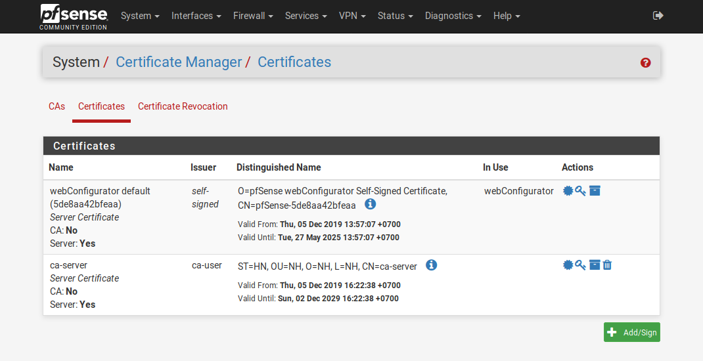
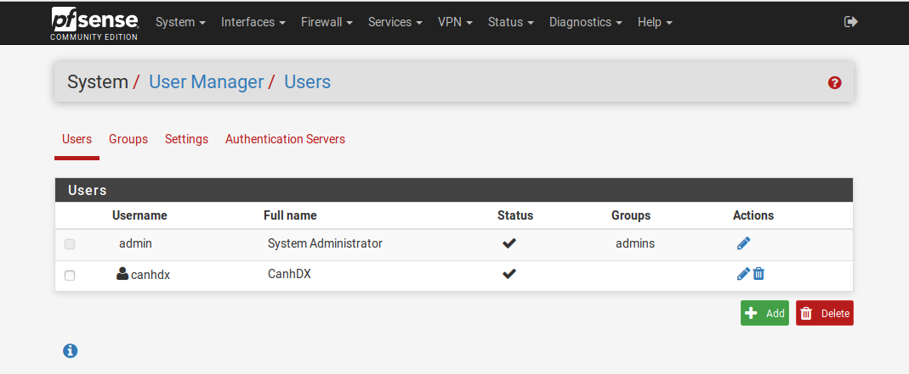
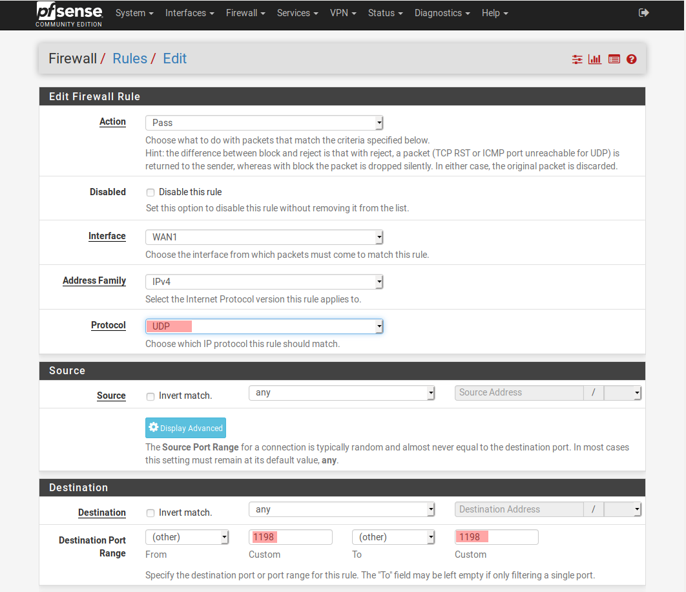

# Cài đặt và sử dụng Pfsense 


- VPNServer 
- Multiwan 

Mô hình cơ bản 


Ip Planning 


- Pfsense sẽ chạy trên KVM 
- Đấu nối xuống Sw-L2 chia VLAN phía dưới 
- Trên máy ảo pfsense, thực hiện đặt ip dùng là gateway cho các vlan


# Cài đặt trên KVM 


Đổi IP theo IP Planning


# Cấu hình cơ bản 

Đăng nhập với tài khoản `admin/pfsense` và cấu hình


Cấu hình `Disable checksum ofload`


> Mục đích là để sử dụng được với device model là “virtio”. Nếu không check vào tùy chọn này, sau này khi tạo vpn mode tap sẽ gặp lỗi máy ping được nhưng không thể ssh.

Cấu hình bổ sung `rules` cho WAN tránh bị disconnect khi thêm interface


Cấu hình thêm interface 


Kết quả kiểm tra trên Cli


# Cấu hình VPN mode TAP

## Tạo Certificate

Truy cập `System/Certificate Manager/CA` -> `Add`


Tại tab `System/Certificate Manager/Certificate`, tạo cho server VPN




## Tạo user VPN 
Truy cập `System/UserManager`




Truy cập `System/Packet Manager` cài đặt thêm Plugin `openvpn-client-export`


Truy cập `VPN/OpenVPN/Server`, click `Add` để tạo VPN server


Khai báo các thông tin về mode kết nối:
- Server mode: Remote Access (SSL/TLS + User Auth)
- Device mode: tap
- Interface: WAN
- Local port: 1198 (tùy ý lựa chọn port)


Khai báo các thông tin về mã hóa
- TLS Configuration: chọn sử dụng TLS key
- Peer Certificate Authority: chọn CA cho hệ thống đã tạo trước đó (server-ca)
- Server certificate: chọn cert cho server được tạo (server-cert)
- Enable NCP: lựa chọn sử dụng mã hóa đường truyền giữa Client và Server, sử dụng các giải thuật mặc định là AES-256-GCM và  AES-128-GCM
- Auth digest algorithm: lựa chọn giải - thuật xác thực kênh truyền là SHA256


Cấu hình Tunnel như sau : 
- Bridge Interface : Chọn VLAN24, các IP của user khi VPN sẽ nhận IP dải VLAN24
- Server Bridge DHCP Start – End : Dải IP cấp cho user VPN
- Inter-client communication : Cho phép các client giao tiếp với nhau qua VPN
- Duplicate Connection : Cho phép các client cùng tên có thể kết nối VPN


Cấu hình Routing : 
- DNS Server 1 & 2 : Đặt DNS 8.8.8.8 và 8.8.4.4
- Custom option : Cho phép các dải mạng LAN được phép kết nối với nhau. 
```sh 
push "route 10.10.24.0 255.255.255.0";push "route 10.10.25.0 255.255.255.0";push "route 10.10.26.0 255.255.255.0"
```


Truy cập `Interfaces` cấu hình thêm Interface OpenVPN, tạo bridge mới và add 2 interface VPN và VLAN24 vào bridge


Truy cập `Firewall` Bổ sung rules firewall cho VPN và lưu lại



Truy cập `Firewall/Rules/OPENVPN` add rule cho phép lưu lượng đi qua


Config NAT Rule : Cho phép inter VLAN, các VLAN có thể giao tiếp với nhau. 

Tại mục : `Firewall/NAT/Outbound`, chọn Add thêm NAT Rule. Chú ý chọn dạng `Hybrid`


Thêm Interface được NAT dải VLAN24


## Export OPENVPN Config và sử dụng 

Tại tab `VPN/OpenVPN/ClientExport`, khai báo các thông số:
- Remote Access Server: lựa chọn OpenVPN server và port 1198
- Hostname Resolution: lựa chọn khai báo Interface IP của WAN 


Lựa chọn và tải config về máy


Tiến hành vpn và xem ip được nhận, ping thử các host cùng dải.
